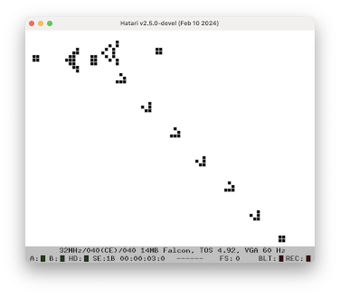
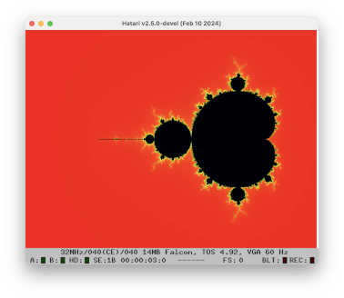

# Hello GEM!
Inspired by Peter Lane's excellent [Atari GEM tutorial](https://peterlane.netlify.app/gemguide/),
I'm attempting to write some simple applications for the Atari ST/Falcon/... My first effort happened
to be a GEM application but there's more here now.

To build/run this, I'm using [EasyAraMint](https://sites.google.com/site/beebox68k/news/2021-10-28-easyaramint-1-0)
on [ARAnyM](https://github.com/aranym/aranym). I confess I've been editing the source code using VS Code and/or Emacs
because I don't fany any of the editors that run on the (emulated) Atari.

The Atari ST is the machine that I learned to program on but, despite spending an awful lot of time learning
GFA BASIC and 68000 assembly, I never wrote anything with a GEM GUI. Having learned C in the years since,
I finally feel brave enough to try to create a simple GEM GUI. Nowadays, I'm used to more modern GUI toolkits like
Java AWT/Swing, GTK and Android's JetPack Compose. GEM, being over 35 years old at this point, is far far more
challenging to work with.

## Contents

### [cppconway](cppconway)
Implementation of Conway's Game of Life in C++ running both in GEM and full screen.

### [mandie](mandie)
Mandelbrot generator that uses 68040 FPU and Falcon highcolour mode.

