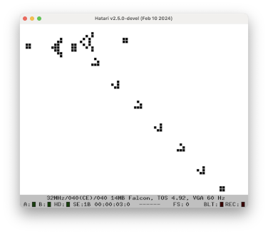

# cppconway
An implementation of Conway's Game Of Life for Atari machines. I've only ever run this in emulators
because my ST has been in a box since 1999 but it runs well on an emulated ST and Falcom in Hatari,
as well as in Aranym.

Written in C++ and built using a cross-mint GCC compiler. Linked against MiNTLib, which results
in the executables being full of several hundred K of library functions that we don't use. This
might have been a problem if we needed to fit them on a floppy disk but doesn't matter so much
nowadays.

The algorithm is heavily inspired by the one described in
[Michael Abrash's Graphics Programming Black Book](https://github.com/jagregory/abrash-black-book).

At the time of writing, there are a few different executables:

## conway.prg
Runs in a GEM GUI. Runs on both Aranym and an emulated real Atari machine in pretty much any
resolution. Fairly slow, though, because it draws the grid to screen using VDI calls.

## fullconw.tos
Runs full-screen in ST high resolution. Much faster than the GEM version. Draws the grid by hitting
screen memory directly. Each frame takes approx **20ms**.

## fastconw.tos
As fullconw.tos above but uses a little bit of 68000 assembly code to speed up the process of
drawing to the screen. Probably not really worth it, given that much a greater speed-up was
achieved by optimising the step method. Each frame takes approx **15ms**.

## highcol.tos
Runs in Falcon highcolour mode (16-bit chunky pixels). This mode makes it less of a hassle to
address individual pixels and consequently makes it easier to make each cell an arbitrary size
without doing horrible bit manipulation. I had assumed that having to write two whole bytes to
screen memory per pixel would make this slower than fastconw.tos. And it _is_ slower, but not
that much slower. Each frame takes approx **45ms** if cell size is 8 pixels.
